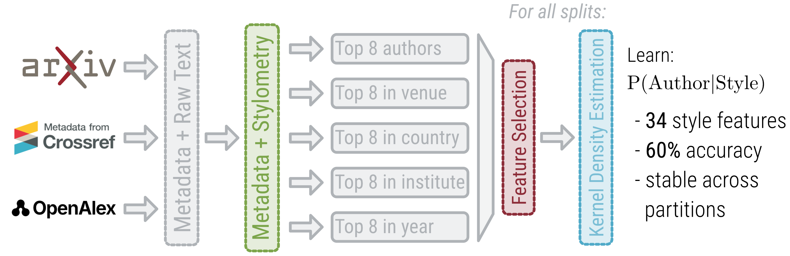

# Data Literacy Project

This project implements a comprehensive **arXiv data pipeline** designed to collect, enrich, clean, and analyze academic papers across multiple disciplines (Computer Science, Economics, EESS, Mathematics, Physics) from 2010 to 2025.



The pipeline automates the extraction of metadata and text features to enable downstream analysis of scientific literature.

## Features

1. **Multi-Category Collection**: Scrapes papers from 5 major arXiv groups.
2. **Metadata Enrichment**: Enhances arXiv data with institutional affiliations, citation counts, and venue information using:
   - **OpenAlex** (via DOI or abstract search)
   - **Crossref** (via DOI, Journal Ref, or Title match)
3. **Data Cleaning**: Filters dataset based on metadata completeness and author productivity constraints.
4. **Feature Extraction**:
   - Downloads source files (HTML/PDF) from arXiv.
   - Extracts raw text from non-PDF sources.
   - Computes word histograms and other text-based features.
5. **Analysis**: Performs statistical analysis on the processed features (e.g., word distribution, author fingerprints).

## Pipeline Steps

The project runs a 7-step pipeline orchestrated by `main.py`:

1.  **Collect Papers**: Searches arXiv API for papers in defined categories (`cs`, `econ`, `eess`, `math`, `physics`). Resume-capable.
2.  **Merge to Raw Dataset**: Combines all collected papers from different categories into a single raw CSV.
3.  **Enrich Metadata**: Queries External APIs (OpenAlex, Crossref) to fill in missing metadata (Affiliations, Countries, Citations).
4.  **Clean Data**:
    - Removes entries with low metadata completeness.
    - Removes authors with fewer than `MIN_PAPERS_PER_AUTHOR` (default: 10) papers.
5.  **Extract Features**:
    - Downloads source tarballs.
    - Extracts text content.
    - Generates word histograms.
6.  **Run Analysis**: Analyzes the extracted features (e.g., PCA, unique author stats).
7.  **Standalone Feature Extraction**: (Optional) Runs feature extraction on any cached text sources independent of the full pipeline.

## Installation

1.  **Clone the repository**:
    ```bash
    git clone <repository_url>
    cd DataLiteracyProject
    ```

2.  **Prerequisites**:
    - Python 3.14+ (or compatible newer version)
    - Recommendation: Use a virtual environment (e.g., `venv` or `uv`).

3.  **Install Dependencies**:
    This project uses `pyproject.toml` for dependency management.
    ```bash
    pip install .
    ```
    Or if you use `uv`:
    ```bash
    uv sync
    ```

## Usage

The main entry point is `main.py`.

### Basic Run
To run the full pipeline from start to finish:
```bash
python main.py
```

### Command Line Arguments
You can control the execution flow using arguments:

- **Start from a specific step**:
  ```bash
  python main.py --skip-to <step_number>
  ```
  *Example*: `python main.py --skip-to 3` (Starts from metadata enrichment)

- **Resume text extraction**:
  If Step 5 failed or stopped, you can resume from a specific index:
  ```bash
  python main.py --skip-to 5 --start-index 1000
  ```

- **Run feature extraction only**:
  Run specific batch extraction on existing cache:
  ```bash
  python main.py --features-only
  ```

### Configuration
Key parameters can be configured directly in the `CONFIGURATION` section of `main.py`:

- `CATEGORY_GROUPS`: specific arXiv categories to scrape.
- `YEARS`: Year range (default: 2010-2025).
- `PAPERS_PER_TOPIC`: Target number of papers per category.
- `DATA_DIR`: Output directory for data (default: `data/`).

## Project Structure

```
DataLiteracyProject/
├── main.py               # Pipeline orchestrator
├── pyproject.toml        # Dependencies and project metadata
├── README.md             # Project documentation
├── data/                 # Generated data (ignored by git usually)
│   ├── cache/            # Cached API responses (ArXiv, OpenAlex) and text files
│   ├── intermediate/     # Partial collection results
│   ├── features/         # Extracted word histograms
│   ├── analysis/         # Analysis results and plots
│   └── *.csv             # Key datasets (raw, enriched, cleaned, processed)
└── src/                  # Source code modules
    ├── scrape_paper_ids.py   # arXiv API interaction
    ├── scrape_metadata.py    # Enrichment logic (OpenAlex/Crossref)
    ├── scrape_text.py        # Text downloading and cleaning
    ├── extract_features.py   # Feature engineering
    ├── analysis.py           # Statistical analysis tools
    └── utils.py              # Helper functions
```

## Authors
Academic Data Literacy Project Team
